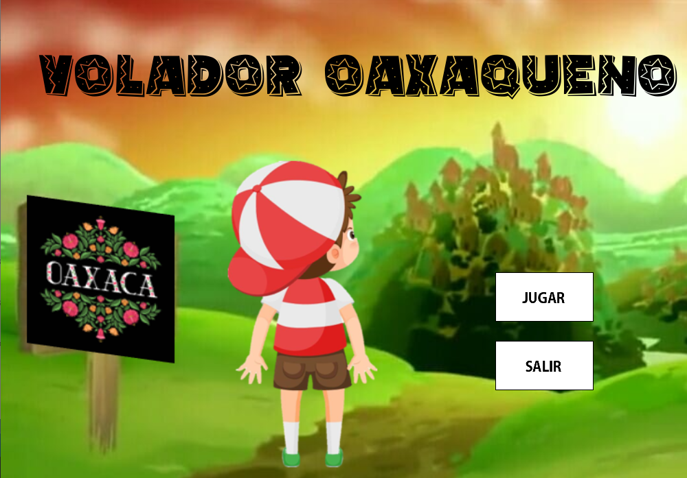
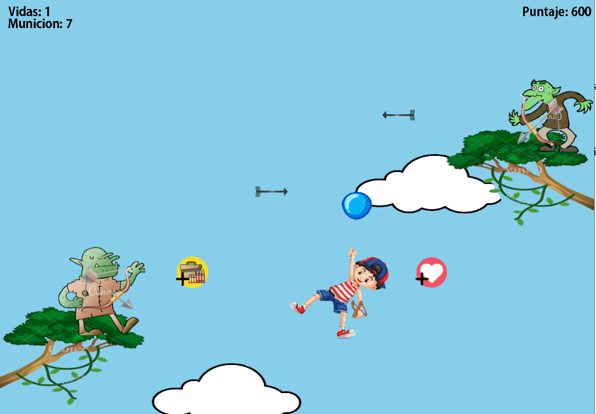
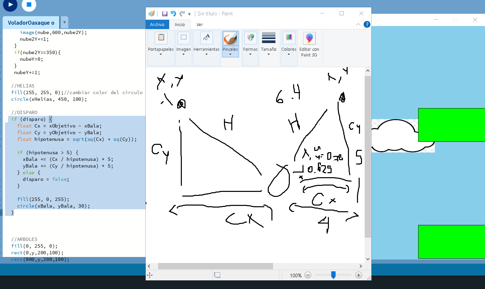

Java Advanced Engineering Suite

Este repositorio integra el desarrollo de algoritmos de alta complejidad y la aplicación de lógica matemática en entornos interactivos, reflejando un dominio sólido de la Programación Orientada a Objetos (OOP) y la optimización de recursos.

Game Engine: "Volador Oaxaqueño"
Desarrollo de un videojuego interactivo en **Processing 4** que aplica conceptos avanzados de física y gestión de estados.

**Mathematical Foundations**
Para lograr un movimiento fluido, implementé lógica de vectores basada en el **Teorema de Pitágoras**.
* **Normalización de Vectores:** Cálculo de la hipotenusa para asegurar que los proyectiles viajen a una velocidad constante hacia las coordenadas del ratón, independientemente de la distancia.
* **Evidencia Técnica:** El proceso de diseño incluyó el modelado matemático de las trayectorias antes de la codificación.

*Documentación técnica: Cálculo de hipotenusa para trayectorias de proyectiles.*

**Technical Features**
* **Dynamic Entity Management:** Uso de `ArrayList` para gestionar balas, enemigos y potenciadores en tiempo real, optimizando la memoria al eliminar objetos fuera de pantalla.
* **Difficulty Scaling:** Algoritmo de probabilidad dinámica que aumenta la agresividad de los enemigos según el puntaje del jugador.

---
 Stack Técnico
* **Lenguaje:** Java 21 (JDK Default).
* **Entorno:** NetBeans & Processing 4.
* **Conceptos clave:** OOP, Estructuras de Datos, Trigonometría aplicada y Gestión de Memoria.